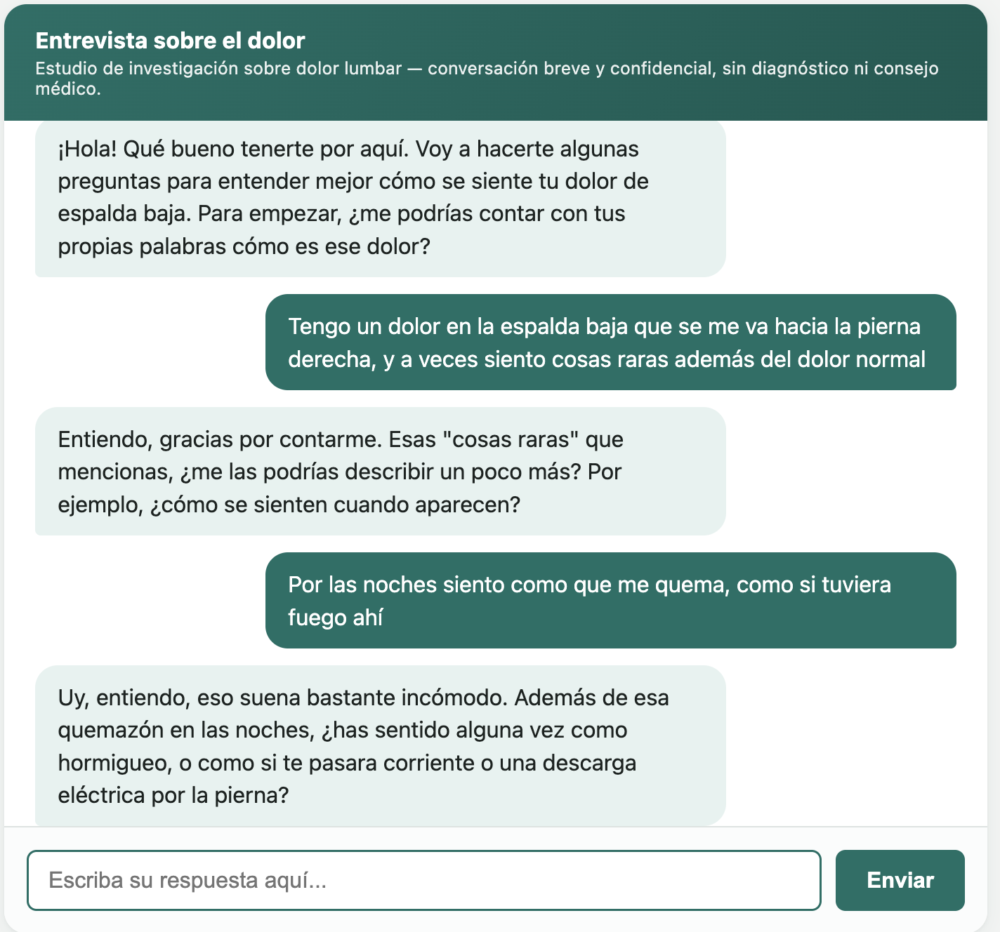
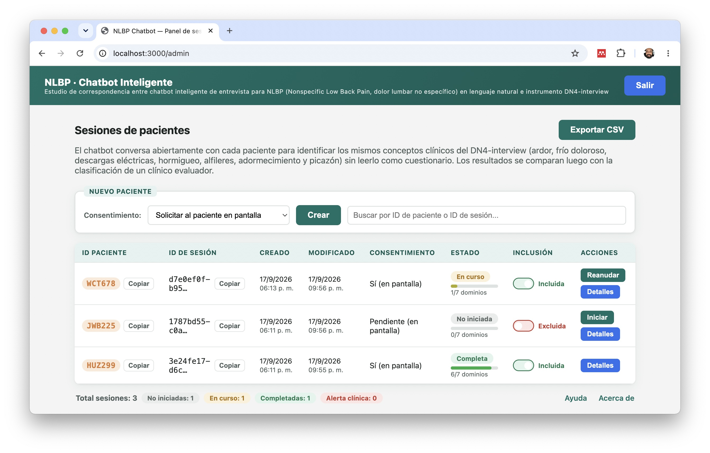
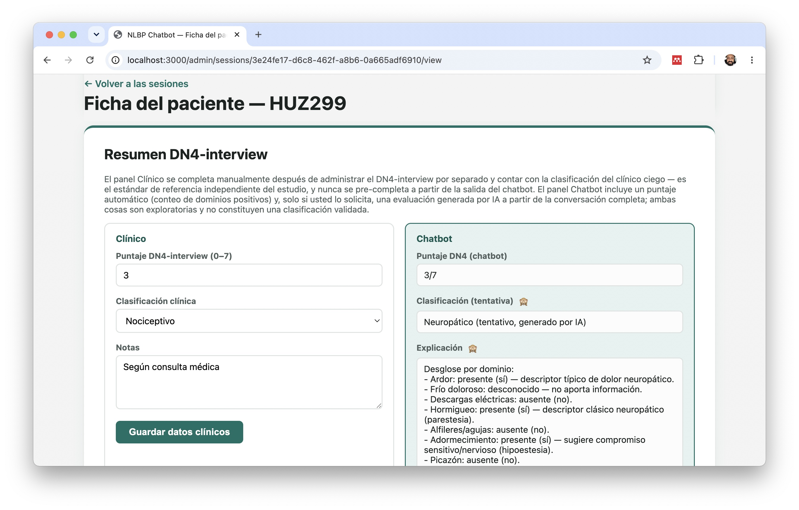

# NLBP Chatbot

<p align="center">
  
  
  
  
  
</p>

<p align="center">
  
</p>

**Can an open, natural conversation with a chatbot stand in for a clinical questionnaire?**
NLBP Chatbot is a research prototype built to test exactly that — it talks with low back
pain patients the way a person would, then checks whether what it hears lines up with the
DN4-interview, the self-reported half of a validated neuropathic-pain questionnaire.

No checklists read aloud to the patient. No diagnosis, clearly stated. Every red-flag symptom gets an inmediate alert.

## What it looks like

<p align="center">
  
</p>
<p align="center"><sub>The patient's whole experience: one open question, then a natural conversation.</sub></p>

<p align="center">
  
</p>
<p align="center"><sub>The researcher's dashboard — every session's status, progress, and consent at a glance.</sub></p>

<p align="center">
  
</p>
<p align="center"><sub>Clinical reference data and the chatbot's own (hidden-by-default) evaluation, side by side.</sub></p>

## Highlights

- **Open conversation, not a form.** The chatbot never reads the 7 clinical domains as a checklist or quotes any questionnaire's wording.
- **Safety built in, not bolted on.** A red-flag symptom stops the interview instantly with a hard-coded message — never something the model improvises.
- **A dashboard that tells you what's happening at a glance** — status, a live progress bar per session, and one-click resume for interrupted interviews.
- **AI-assisted comparison, kept honest.** An optional, on-demand Claude evaluation sits next to the clinician's own independent judgment — hidden by default, and never used to pre-fill it.
- **Runs on one laptop, talks to no one else.** Binds only to `localhost`; the only outbound call is to Anthropic's API. No patient name, ID, or contact info is ever stored.
- **One click to a full CSV** — every domain, both classifications, and the full transcript, ready for analysis.

## Quick start

```bash
git clone https://github.com/sargaleano/nlbp-chatbot.git
cd nlbp-chatbot
npm install
npm run setup     # creates .env with a generated admin password
npm start          # → http://localhost:3000/admin
```

Needs Node.js 22.13+. That's the whole setup — no native compilation, no database server, no cloud account beyond an Anthropic API key.

## Full documentation

The user-interface tour above is intentionally the whole story here. Everything else —
installation troubleshooting, the admin workflow end to end, the data model, API routes,
security design, and what's deliberately out of scope for this Phase 1 — lives in:

- **[`docs/guia-usuario-nlbp-chatbot.pdf`](./docs/guia-usuario-nlbp-chatbot.pdf)** — user guide (Spanish), for whoever runs sessions day to day.
- **[`docs/especificacion-tecnica-nlbp-chatbot.pdf`](./docs/especificacion-tecnica-nlbp-chatbot.pdf)** — technical specification (Spanish), for anyone extending, auditing, or replicating this.

## Status & license

Phase 1 research prototype. **Not a diagnostic device, not for clinical use.** MIT-licensed
(see [`LICENSE`](./LICENSE)) — replicate or adapt it for your own study; see
[`CONTRIBUTING.md`](./CONTRIBUTING.md) if you'd like to send changes back.
